# Cara Menjalankan Project

Sebelum mulai, pastikan beberapa tools ini sudah terpasang:

- Maven
- JDK 11
- Angular CLI

## Menjalankan backend

```bash
mvn spring-boot:run
```

## Menjalankan frontend

```bash
cd frontend
ng serve
```

## Menjalankan unit test backend

```bash
mvn test
```

# Screenshot

## API testing

### 1. Get All Notes
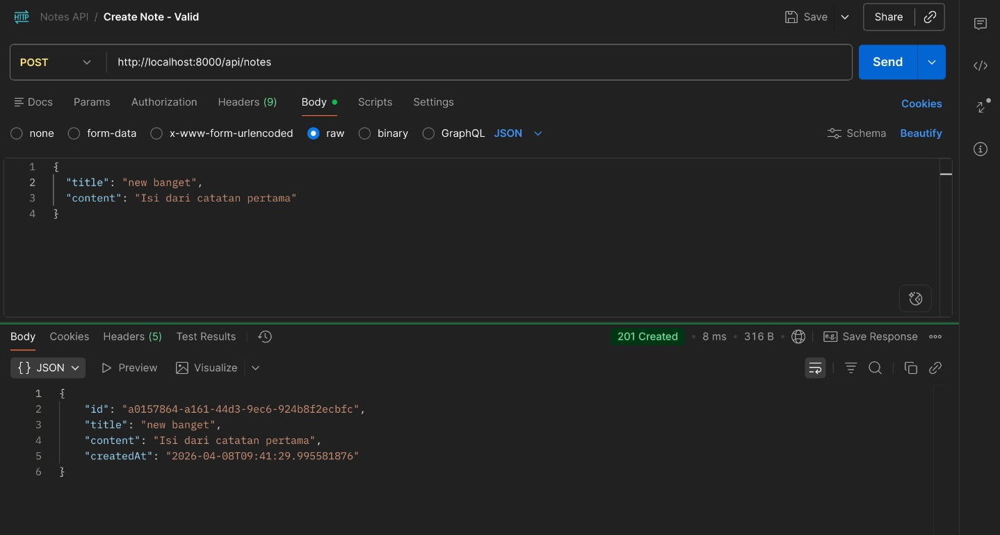

### 2. Create Note - Valid
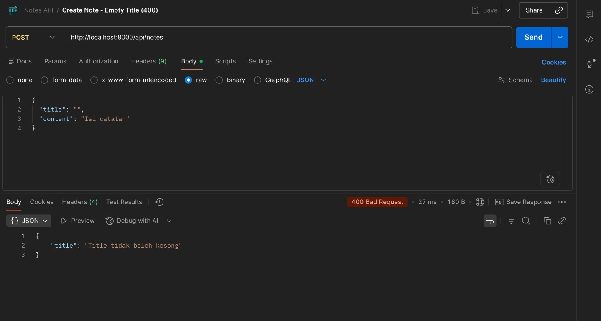

### 3. Create Note - Empty Title (400)
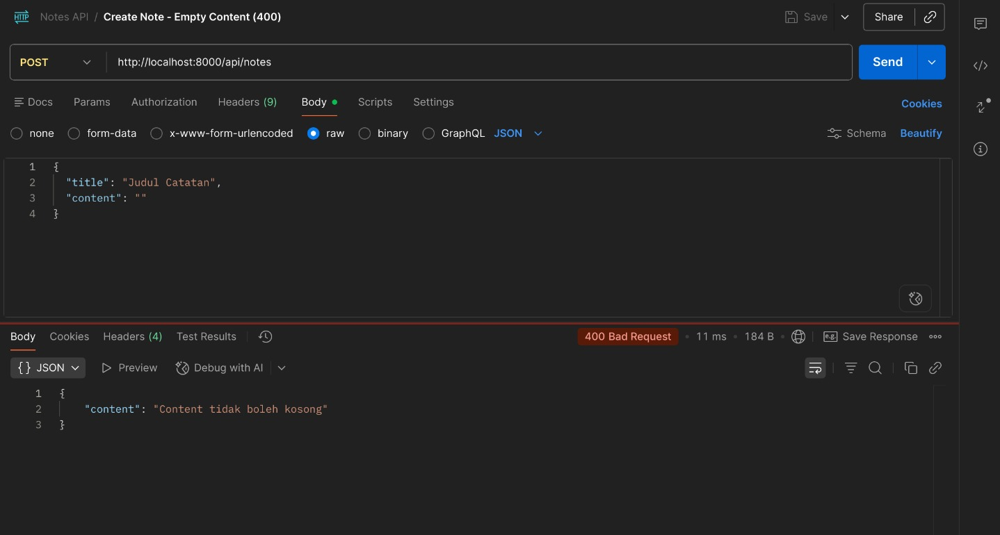

### 4. Create Note - Empty Content (400)
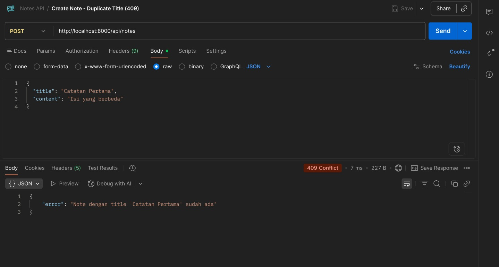

### 5. Create Note - Duplicate Title (409)
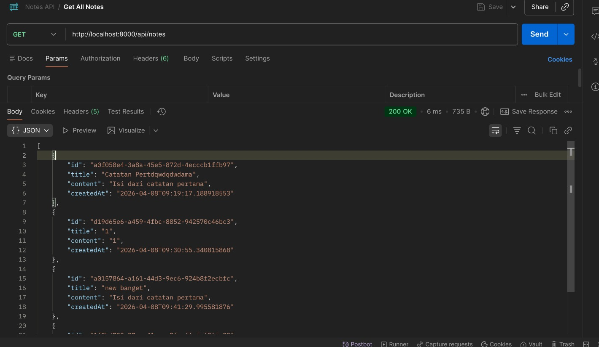

### 6. Delete Note by ID - Valid
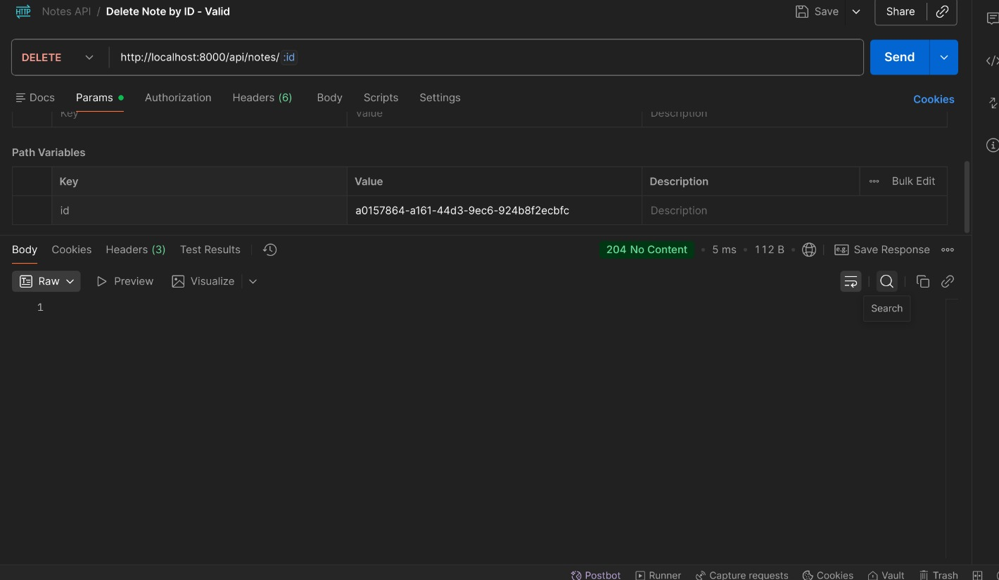

### 7. Delete Note by ID - Not Found (404)
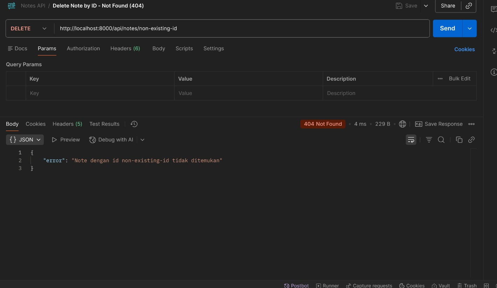

### 8. Delete Note by Title - Valid
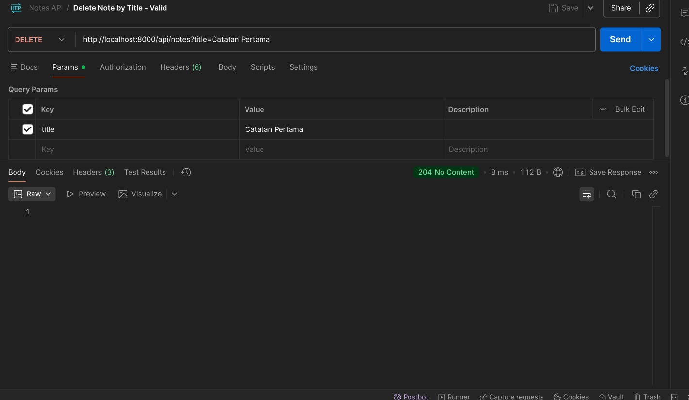

### 9. Delete Note by Title - Not Found (404)
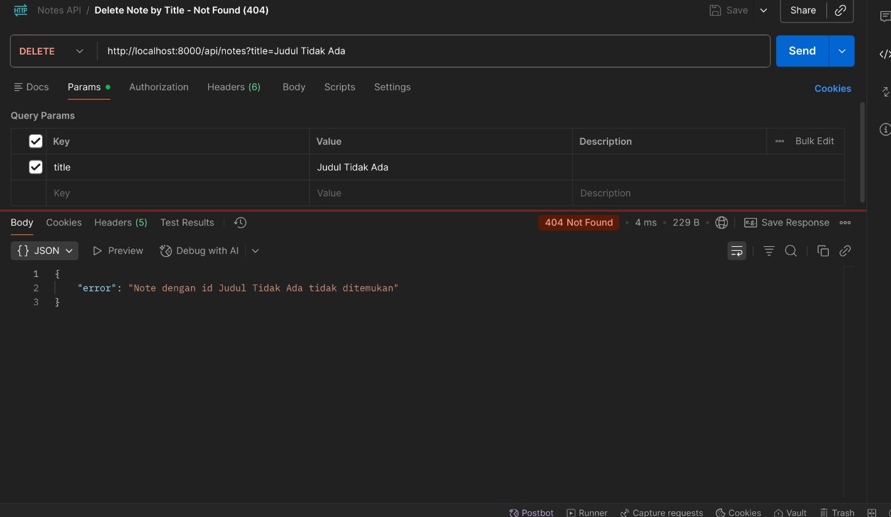

## Web

### 10. Tampilan Web 1
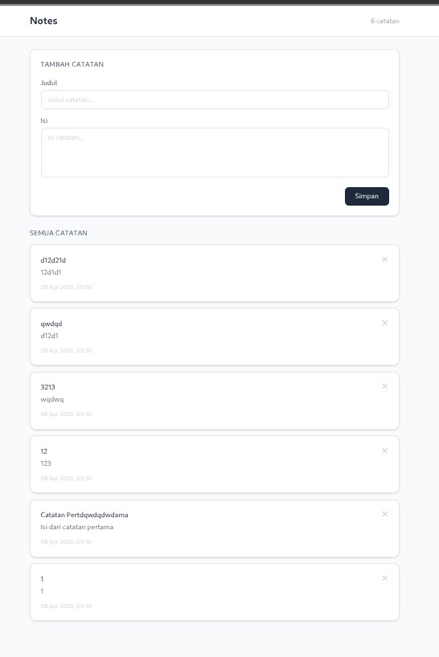

### 11. Tampilan Web 2
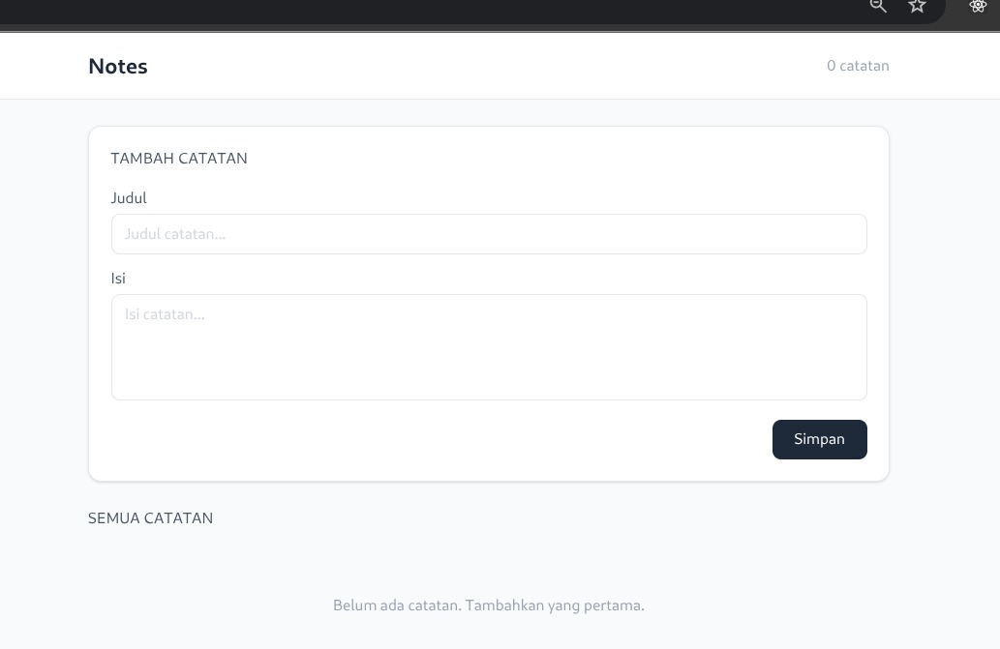

## Unit testing

### 12. Hasil Unit Testing
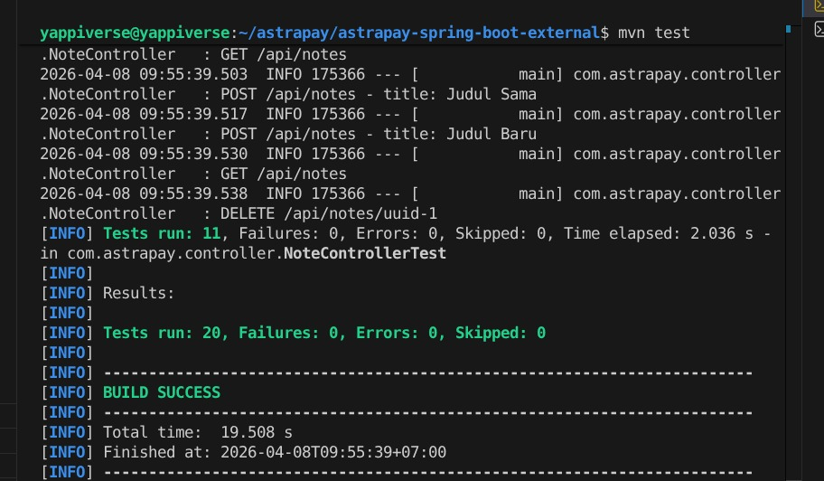